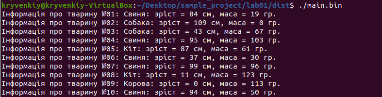
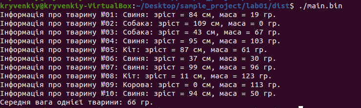
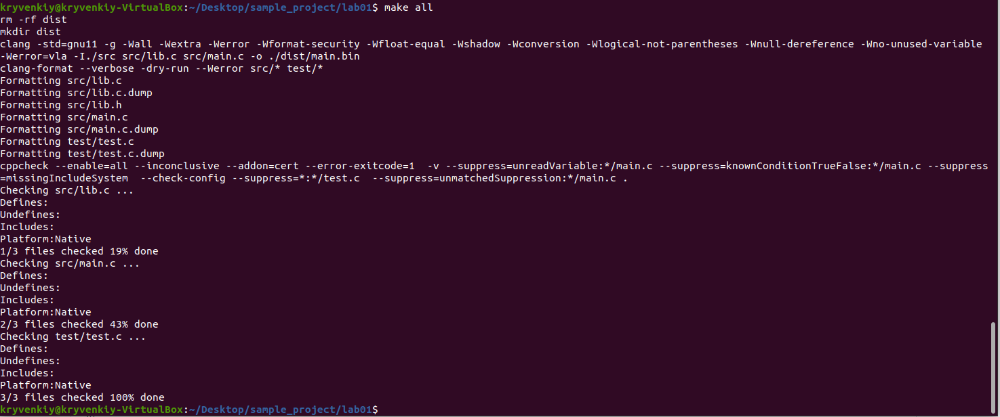

# Лабораторна робота № 1. Вступ до програмування. Освоєння командної строки Linux

## 1. Вимоги

### 1.1 Розробник

* Кривенький Нікіта Миколайович;
* студент групи КІТ-121д;
* 10 вересня 2021р.

### 1.2 Загальне завдання

Установка середовища для подальшої роботі з предмету
“Програмування”.

## 2. Хід роботи

### 2.1 Внесення змін до початкового коду програми

У файлі *lib.c* у функцію *show_animals*, що відповідає за виведення даних на екран користувача було додано наступні змінні:

- *total_w* - змінна що входить в цикл виведення даних задля визначення загальної маси всіх тварин без створення зайвих циклів.
- *avg_w* - змінна яка визначає середню вагу тварини з усіх поданих у списку, ії значення виводиться на екран користувача.
#### Створення змінних
```c
	unsigned int total_w = 0;
	for (unsigned int i = 0; i < count; i++) {
	...
	total_w += animals[i].weight;
}
```
#### Виведення даних на екран користувача
```c
	unsigned int avg_w = total_w / count;
        printf("Середня вага однієї тварини: %u гр. \n", avg_w);
```
Таким чином вивід на екран з початкового 



Набув наступного вигляду:



### 2.2 Внесення змін до Makefile

Для додання цілі *all*, яка буде виконувати цілі *clean prep compile check*, відкриваємо файл Makefile за допомогою текстового редактора, та вносимо наступні зміни:
```c
	+ all: clean prep compile check
```
Виконуємо команду *make all* щоб засвідчитись, що Makefile працює вірно.


Щоб Makefile при виконанні команди *make all* не створював файл *test.bin* видалимо рядки коду, пов'язані зі створенням та використанням цього файлу:

```c
	- test.bin: test/test.c
	$(CC) $(C_OPTS) $< -o ./dist/$@
	
	- test: clean prep compile
	./dist/test.bin
	
	compile: main.bin (- test.bin)
```
Структура проекту після виконання команди *make all*:
```
└── lab01
    ├── dist
    │   └── main.bin
    ├── Doxyfile
    ├── Makefile
    ├── README.md
    ├── src
    │   ├── lib.c
    │   ├── lib.h
    │   └── main.c
    └── test
        └── test.c

```
### 2.3 Утіліта man та її призначення.

man (від англ. manual — керівництво, посібник) — команда Unix, призначена для форматування й виведення довідкових сторінок. 
Її доцільно використовувати для кращого розуміння того, як слід працювати з певними командами, яких вхідних даних вони потребують, тощо.
Для того, щоб скористатись утілітою man достатньо ввести в терміналі man man, де замість останнього man можна ввести назву будь-якої іншої команди.
У випадку, якщо ввести man man - отримаємо першу сторінку довідки для саме цієї команди.

## Висновки

При виконанні даної лабораторної роботи було набуто практичного досвіду роботи із ОС Linux, його командною строкою, утілітами tree, git, man, та іншими.
