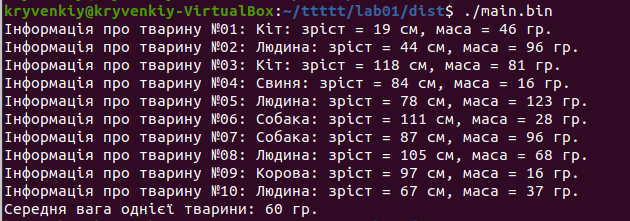

# Лабораторна робота №2. Вступ до програмування. Основи debug процессу

## 1 Вимоги

### 1.1 Розробник

* Кривенький Нікіта Миколайович;
* студент групи КІТ-121д;
* 10 вересня 2021р.
## 2. Хід роботи

### 2.1 Внесення змін до початкового коду програми

Для того щоб створити новий тип тварини "Людина" та вивести його на екран виконаємо наступні дії:

- У текстовому редакторі *nano* відкриємо файл "lib.h".
- Внесемо новий тип тварини до списку тварин: 
```c
	enum animal_type {
        HUMAN, //< Людина */
        ...
};
```
- Зберігаємо зміни та відкриваємо файл "lib.c".
- Додамо у програму дії які необхідно виконати, якщо тип тварини - *"Людина"* аналогічно з іншими типами.
- Компілюємо програму та виконуємо бінарний файл, щоб засвідчитися, що все написано правильно та новий тип тварин дійсно виводиться на екран користувача.

#### Отримуємо такий результат при виконанні програми:



### 2.2 Основні положення роботи з відлагодником lldb.

Для того, щоб відкрити виконуючий файл за допомогую відлагодника *lldb* переходимо до директорії, де він знаходиться.
За допомогою команди lldb filename встановлюємо що саме потрібний нам виконуючий файл (який буде вказано на місці filename) буде відкрито за допомогою відлагодника.
Переглянути код програми можна за допомогою команди *list*. Для того щоб зупинитись на певному рядку в програмі можна встановити точку зупинки, за допомогою команди b 34 (де 34 - номер рядка на якому зупиниться виконання програми). Щоб запустити процес компіляції досить ввести команду r (скорочено від run).
Щоб переглянути, яких значень набувають змінні на даному етапі виконання програми можна скористатись командою v. В терміналі з'явяться дані про всі змінні, що існують в програмі на даний момент часу.
Для продовження виконання програми по крокам можна скористатись наступними командами:
- S (step in) - перейти до наступного кроку виконання програми. Якщо дія включає виклик функції, програма вступає у її реалізацію і припиняє виконання під час першої дії цієї реалізації.
- N (step over) - перейти до наступного кроку виконання програми. Якщо дія передбачає виклик функції, вона не переходить до її реалізації (замість цього переступає через неї).
- F (step out) - перейти до наступного кроку виконання. Ця команда дозволяє виконувати програму до тих пір, поки не буде повернуто реалізацію операції, яка наразі виконується.

### 2.3 Основні відмінності режиму компіляції з інформацією про відлагодження та без неї.

Режим компіляції що надає інформацію про відлагодження містить в собі детальну інформацію про кожну змінну, що використовується в програмі, адреса пам'яті, використані типи даних та ін., що зокрема полегшує перехід між машинним кодом та початковим кодом, у той час як компіляція без інформації про відлагодження являє собою лишень оптимізованим кодом програми, не загромоджуючи користувача інформацією.

## Висновки

При виконанні даної лабораторної роботи було набуто практичного досвіду роботи із відлагодником (debugger), командами Step In, Step Out, Step Over,знання про процес компіляції з інформацією про відлагодження.
